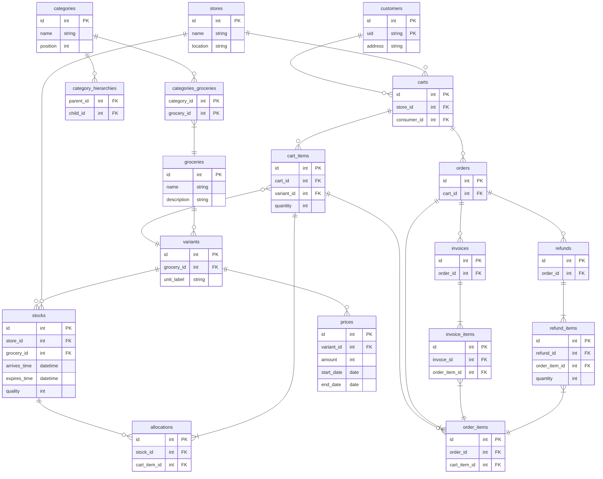

Grocery store
---

# ER diagram

```mermaid
erDiagram

customers {
    id int PK
    uid string PK
    address string
}

carts {
    id int PK
    store_id int FK
    consumer_id int FK
}

cart_items {
    id int PK
    cart_id int FK
    variant_id int FK
    quantity int
}

orders {
    id int PK
    cart_id int FK
}

order_items {
    id int PK
    order_id int FK
    cart_item_id int FK
}

invoices {
    id int PK
    order_id int FK
}

invoice_items {
    id int PK
    invoce_id int FK
    order_item_id int FK
}

refunds {
    id int PK
    order_id int FK
}

refund_items {
    id int PK
    refund_id int FK
    order_item_id int FK
    quantity int
}

categories {
    id int PK
    name string
    position int
}

category_hierarchies {
    parent_id int FK
    child_id int FK
}

categories_groceries {
    category_id int PK
    grocery_id int PK
}

groceries {
    id int PK
    name string
    description string
}

variants {
    id int PK
    grocery_id int FK
    unit_label string
}

prices {
    id int PK
    variant_id int FK
    amount int
    start_date date
    end_date date
}

stores {
    id int PK
    name string
    location string
}

stocks {
    id int PK
    store_id int FK
    grocery_id int FK
    arrives_time datetime
    expires_time datetime
    quality int
}

allocations {
    id int PK
    stock_id int FK
    cart_item_id int FK
}


customers ||--o{ carts : ""
stores ||--o{ carts : ""
carts ||--o{ cart_items : ""
cart_items }o--|| variants : ""
categories ||--o{ category_hierarchies : ""
categories ||--o{ categories_groceries : ""
categories_groceries }|--|| groceries : ""
groceries ||--o{ variants : ""
variants ||--o{ stocks : ""
variants ||--o{ prices : ""
stores ||--o{ stocks : ""
stocks ||--o{ allocations : ""
cart_items ||--|{ allocations : ""
carts ||--o{ orders : ""
cart_items ||--o{ order_items : ""
orders ||--|{ order_items : ""
orders ||--o{ invoices : ""
invoices ||--|{ invoice_items : ""
invoice_items }|--|| order_items : ""
orders ||--o{ refunds : ""
refunds ||--|{ refund_items : ""
refund_items }|--|| order_items : ""

```